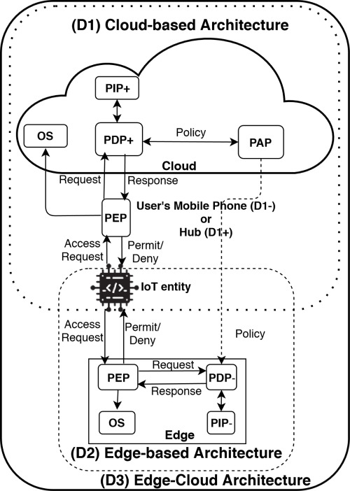

To unlock the real potential of the Internet of Things (IoT), current IoT solutions have to identify the best possible trade-off between different needs, including  latency, security, and privacy. 

In this work we propose the use of the **CAP Theorem** (ref. [here](https://www.educative.io/edpresso/what-is-the-cap-theorem) for a brief introduction) to investigate the trade-offs associated with enforcing Access Control (AC) in the context of **distributed IoT systems**. We adopted the *Lazy Access Control as a Service* (ACaaS) paradigm described in \[1] to identify and configure three deployment models on top of the [Amazon AWS](https://aws.amazon.com) Cloud and Edge infrastructures:
* Cloud (D1) - where all AC requests are processed in the cloud, i.e. by the [AWS IoT](https://aws.amazon.com/iot) service;
* Edge (D2) - where all AC requests are processed locally by edge nodes (created using the [AWS Greengrass](https://aws.amazon.com/greengrass) service);
* Cloud-edge (D3) - where most of the requests are processed as in D2 while the remaining according to D1.

Following figure provides the deployment models with respect to a smart-lock system (named IoT entity in the figure) and the components prescribed in the [XACML](http://docs.oasis-open.org/xacml/3.0/xacml-3.0-core-spec-os-en.html) (eXtensible Access Control Markup Language) policy definition language: a Policy Enforcement Point (PEP) that intercepts authorization requests, sends them to the Policy Decision Point (PDP) and waits the access decision to enforce (grant or deny), possibly complemented with obligations (processed by the Obligation Service - OS); a Policy Decision Point (PDP), responsible to authorize or deny requests evalutating the attributes collected by querying a Policy Information Point (PIP) and the policies requested to the Policy Administration Point (PAP). We indicate with ''-" a limited PIP or PDP that accounts for resource-constrained devices (tipically found in edge scenarios).

We complement the analysis with a performance evaluation that assess latency and throughput of requests, and provide additional security considerations (as suggested in \[2]). Our main contributions are:

* Combining the CAP Theorem with the requirements for AC in IoT environments proposed in \[1], and provide a security and performance evaluation of three different architectures that supports a smart-lock scenario: cloud-based, edge-based or edge-oriented. 

  Following state-of-the-art approaches (e.g., the [work](https://dl.acm.org/doi/10.1145/2897845.2897886) of Grant et. al), we investigate security by defining a threat model, two types of attackers and applicable vulnerabilities; the analysis focuses on the ability to bypass the revocation of permissions or the logging of requests. 

  We evaluate performance with two well recognized metrics (as in the [work](https://onlinelibrary.wiley.com/doi/book/10.1002/9781118763407) of Eric Bauer and Randee Adams): latency and throughput. We use [Apache JMeter](https://jmeter.apache.org) to simulate the batch sending of AC requests or a costant rate of AC req./s.

* Following the suggestion in \[2], discuss the relationships between identified trade-offs and security issues to highlight the guarantees offered by the different architectures.

Complete test results and configurations are available [here](assets/SACMAT2020/SACMAT2020.zip).

[\[1\]](https://www.researchgate.net/publication/325633706_A_Lazy_Approach_to_Access_Control_as_a_Service_ACaaS_for_IoT_An_AWS_Case_Study): Ahmad Tahir, Morelli Umberto, Ranise Silvio and Zannone Nicola. (2018). A Lazy Approach to Access Control as a Service (ACaaS) for IoT: An AWS Case Study. 235-246. 10.1145/3205977.3205989. 

[\[2\]](https://dspace.mit.edu/handle/1721.1/79112): Gilbert, Seth, and Nancy Lynch. Perspectives on the CAP Theorem. Computer 45, no. 2 (February 2012): 30-36.